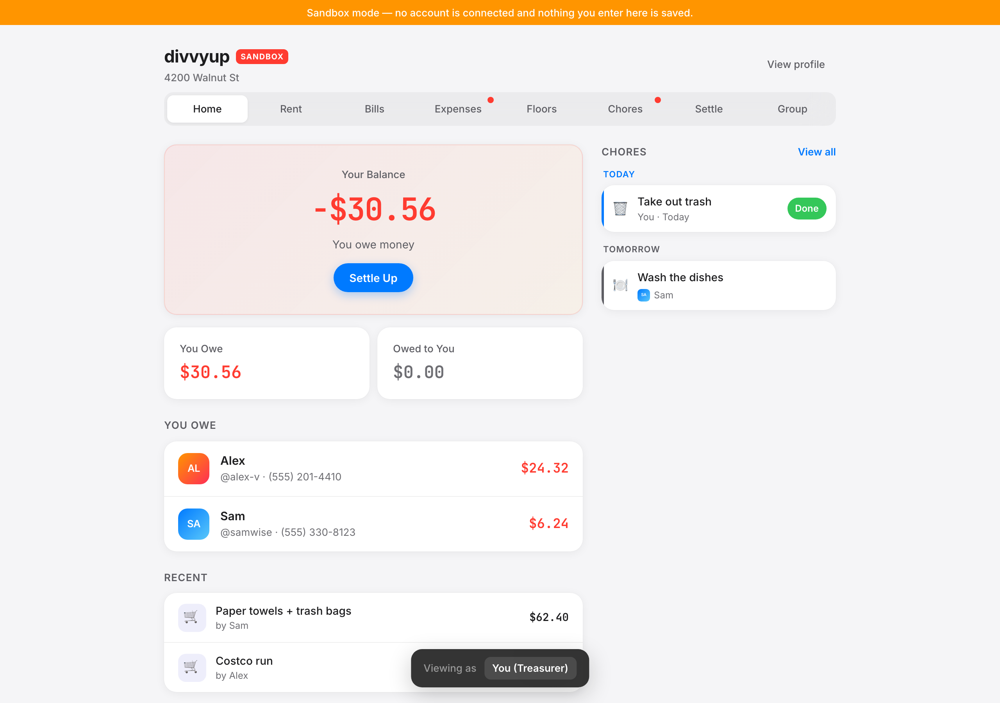
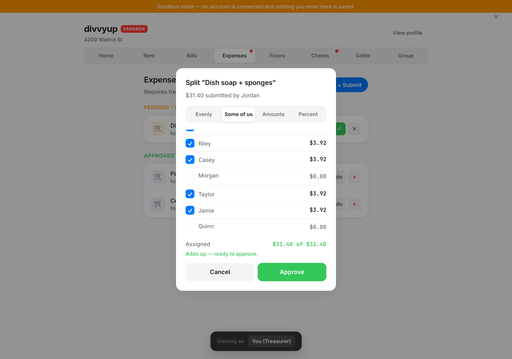
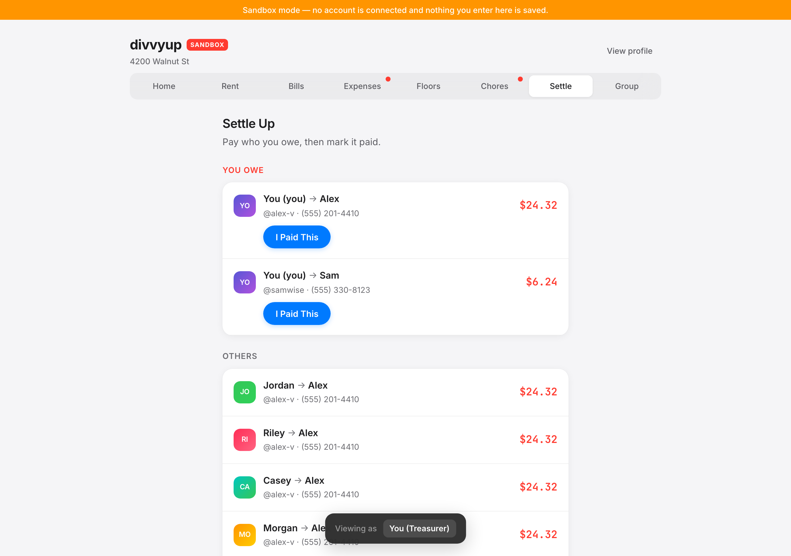
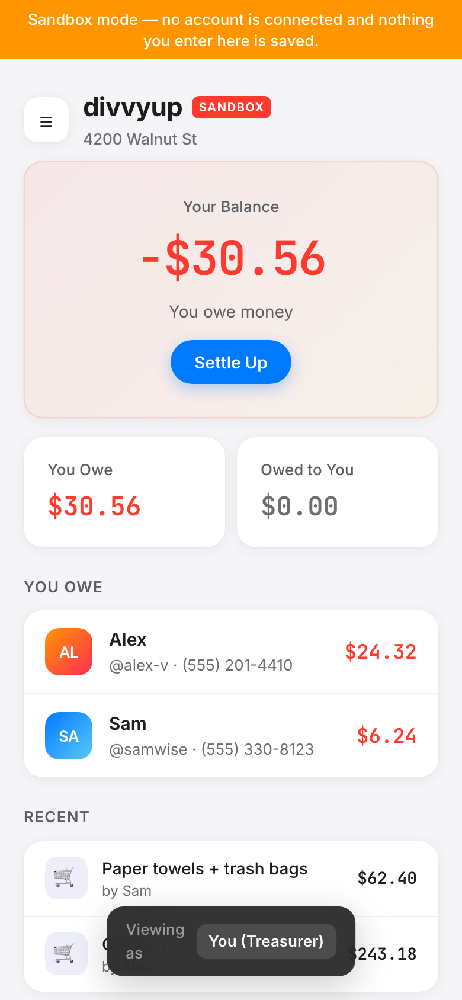

# DivvyUp

**Shared-expense management for houses too big for a group chat.**

[**Live demo**](https://divvy-ughiy928m-danielranaudos-projects.vercel.app) ·
[Run it locally](#run-it) · [Engineering notes](#engineering-highlights)

[](https://github.com/DanielRanaudo/DivvyUp/actions/workflows/ci.yml)


Rent, utilities, groceries, and chores split across a ten-person house — with an
approval trail, minimized settlement payments, a monthly close-out, and live sync
between everyone's phones.



<table>
<tr>
<td width="50%"></td>
<td width="50%"></td>
</tr>
<tr>
<td><em>Four split modes, live validation, penny-exact shares.</em></td>
<td><em>Settlements reduced to the fewest possible transfers.</em></td>
</tr>
</table>

<p align="center">
  
  <br><em>Mobile-first, installable to a home screen — it gets used standing in a kitchen.</em>
</p>

---

## Why I built this

I'm moving into a house with **ten people**.

Ten people means ten Venmo requests per bill, one person permanently fronting
the utility company and chasing everyone else for it, and a group chat where
"I'll get you back" goes to die. Splitting anything fairly gets genuinely hard
at that size: rent isn't equal because the rooms aren't equal, only four of us
share the second-floor bathroom supplies, and somebody has to decide whether the
$243 Costco run gets split ten ways or eight.

The part I care most about is the settlement math. Ten people owing each other
in every direction is up to **45 separate payments**. DivvyUp nets everyone's
position down to a single balance and matches debtors against creditors, so a
month usually closes out in a handful of transfers instead of dozens — and
nobody is stuck being the house bank.

---

## Features

**Money** — rent (equal, percentage, or custom per person, recurring monthly) ·
one-off and recurring bills · roommate-fronted expenses with receipt photos and
treasurer approval · four split modes (even, subset, exact, percentage), all
penny-exact so balances net to zero · sub-groups ("floors") with their own
members and bills · settlement engine that minimizes the *number* of transfers,
not just the totals · two-sided payment confirmation · monthly close-out with a
compressed carry-forward ledger and browsable archive · CSV export · Venmo/Zelle
handles surfaced next to what you owe.

**Household** — chores with fixed or round-robin assignment, repeat intervals,
and a projected calendar · dashboard of your balance, what's due, and what's
waiting on you · multi-group membership by invite code · treasurer role that can
be handed off · member removal that blocks on open balances and re-splits rent ·
daily digest emails · profiles mirrored across every group you're in.

**Product** — installable mobile-first PWA · realtime sync · optimistic UI with
rollback · backend-free demo mode with a user switcher · accessibility (focus
traps, ARIA live regions, `prefers-reduced-motion`) · deep-linkable URLs.

---

## Engineering highlights

### Authorization lives in Postgres, not the client

The browser talks to Supabase directly, so every authorization decision is
enforced by row-level security and `SECURITY DEFINER` RPCs:

- Members read only their own groups; rent and bills are treasurer-only writes;
  payments are confirmable only by the recipient.
- Sensitive transitions are RPCs, validated server-side — `approve_expense`
  re-derives splits and checks they sum to the amount within a cent,
  `confirm_payment` refuses amount changes mid-confirmation, `transfer_treasurer`
  is the only path to the role.
- A column-guard trigger blocks members from editing protected fields on their
  own membership row, `is_treasurer` above all.
- Invite codes are 10 CSPRNG characters over an unambiguous 32-symbol alphabet,
  with failed lookups rate-limited per user and wrong codes returning null.

A hardening migration closed real holes in the baseline schema — self-promotion
to treasurer, inserting a pre-approved expense, choosing your own splits. Each
one now has a test proving it stays closed.

### Tests that assert the attacks fail

| Layer | Tool | Covers |
|---|---|---|
| **209 unit tests** (16 files) | Vitest | Money logic — splits, settlements, chore rotation, close-out, member removal, CSV escaping — plus diff-based persistence against a fake Supabase client |
| **11 browser tests** | Playwright | The full household path: front an expense, approve, settle, confirm, close the month |
| **59 database assertions** | pgTAP | Authorization from an ordinary member's session: every privilege escalation and concurrent-write attack fails |

All three run in GitHub Actions on every push and PR, alongside lint, typecheck,
and a production build.

### Concurrency for a house of ten

Chores and sub-groups are JSON documents carrying a **version counter** — the
client sends the version it read and Postgres rejects the write if the document
moved on, so simultaneous edits surface a refetch instead of silently losing one.
Realtime has the mirror problem, so incoming refetches are deferred while a local
write is pending and event bursts are debounced into one.

### State and persistence

Group state lives in React and is written through to Supabase as a **diff**
(`persistGroupDiff` in [src/lib/api.ts](src/lib/api.ts)): compare next state
against last known server state, emit the minimal set of operations, roll the UI
back if any fail. Writes are serialized so two saves can't interleave.

### Security beyond auth

Strict CSP plus HSTS, `X-Frame-Options: DENY`, `nosniff`, and a locked-down
`Permissions-Policy` · receipts in a private bucket served through short-lived
signed URLs · CSV formula-injection defense · timing-safe cron token comparison ·
fail-closed config (a production build with missing env vars throws rather than
shipping an in-memory demo) · Sentry reports carrying user id only.

---

## Tech stack

| | |
|---|---|
| **Framework** | Next.js 16 (App Router, Turbopack, Proxy middleware for session refresh) |
| **UI** | React 19, TypeScript (strict), Tailwind v4, hand-rolled design tokens |
| **Backend** | Supabase — Postgres, RLS, `SECURITY DEFINER` RPCs, Realtime, Storage, Auth |
| **Testing** | Vitest, Playwright, pgTAP |
| **Ops** | GitHub Actions CI, Vercel (+ Cron), Sentry, Resend SMTP, Dependabot |

~17k lines of TypeScript and ~2.5k lines of SQL, hand-written across six migrations.

---

## Run it

**Demo mode — no backend, no signup:**

```bash
npm install
npm run sandbox    # nine fake roommates, in-memory data, user switcher
```

Open [http://localhost:3000](http://localhost:3000). The header's user switcher
lets you submit an expense as one roommate and approve it as the treasurer —
the screenshots above are this mode.

**With a real backend:**

1. Create a project at [supabase.com](https://supabase.com).
2. `npx supabase link --project-ref <ref>` then `npm run db:push` to apply
   migrations (tables, RLS, RPCs, storage buckets, realtime publication).
3. Copy `.env.example` to `.env.local` and fill in the project URL and anon key.
4. In **Authentication → URL Configuration**, set the site URL and add
   `/reset-password` as a redirect URL.
5. `npm run dev`.

| Script | Purpose |
|--------|---------|
| `npm run dev` / `npm run sandbox` | Dev server (backend / demo mode) |
| `npm test` / `npm run test:e2e` / `npm run db:test` | Vitest / Playwright / pgTAP |
| `npm run db:push` / `npm run db:reset` | Apply migrations / rebuild local DB |
| `npm run lint` / `npm run typecheck` | ESLint / TypeScript |
| `npm run build` | Production build |

The database tests need Docker running (`npx supabase start` first).

---

## Project structure

```
src/
├── app/            # App Router: auth gating, reminders cron route, password reset
├── components/     # AppShell, screens/, tabs/, dashboard/, expenses/, periods/
├── context/        # Supabase session provider
├── hooks/          # Group store (optimistic writes), realtime, URL routing
└── lib/            # settlements · splits · charges · periods · members · chores
                    # · csv · reminders · receipts · api (diff persistence)
e2e/                # Playwright smoke tests (sandbox mode)
supabase/
├── migrations/     # Tables, RLS, RPCs, storage, realtime
└── tests/          # pgTAP suites proving the RLS rules hold
```

---

## More

- **[Troubleshooting & ops notes](docs/TROUBLESHOOTING.md)** — symptom → cause →
  fix for the problems that actually came up, plus the production-readiness
  audit and what it closed.

**Deployment.** [Vercel](https://vercel.com): import the repo, set
`NEXT_PUBLIC_SUPABASE_URL` and `NEXT_PUBLIC_SUPABASE_ANON_KEY`, and add the
production domain to Supabase's auth URL configuration. `vercel.json` schedules
the daily reminder job; auth emails go through [Resend](https://resend.com) SMTP.
Sentry and reminder emails are optional — without their env vars the app runs
normally. Migrations are append-only and safe to re-run.

---

## License

MIT © Daniel Ranaudo
